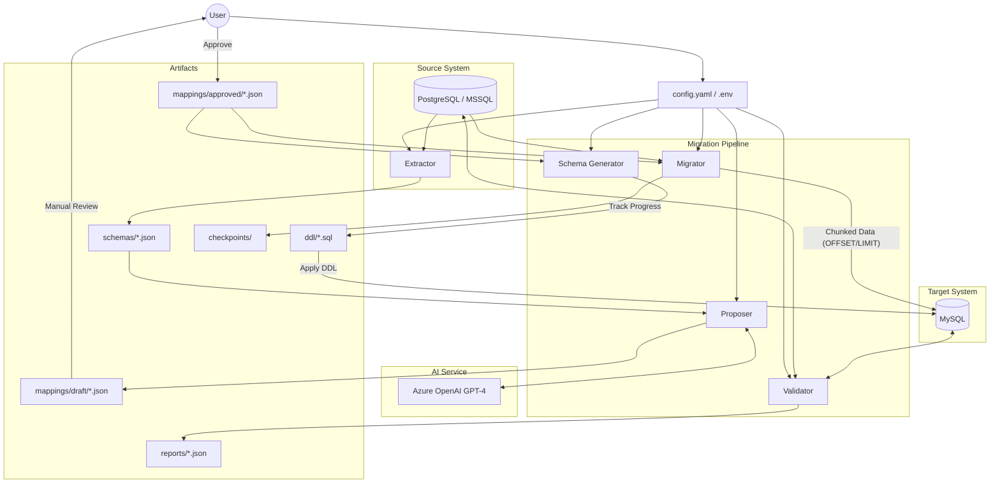

# DB Migrator — PostgreSQL / SQL Server → MySQL Migration

Migrate from **PostgreSQL** or **SQL Server (Azure SQL)** to **MySQL** with AI-assisted schema translation and safe, resumable data transfer.

Uses **Azure OpenAI (GPT-4.1)** to intelligently translate column types and generate MySQL DDL, with a human review step before anything is applied.

---

## How It Works



---

## Quick Start

### 1. Install

```bash
pip install -r requirements.txt

# Install the database drivers:
pip install psycopg2-binary       # PostgreSQL source
pip install pyodbc                # SQL Server source
pip install mysql-connector-python # MySQL target
```

### 2. Configure

```bash
cp .env.example .env
```

Edit `.env` with your actual credentials:

```env
# Azure OpenAI
AZURE_OPENAI_API_KEY=your-key
AZURE_OPENAI_ENDPOINT=https://your-resource.openai.azure.com/
AZURE_OPENAI_DEPLOYMENT=gpt-4.1

# PostgreSQL Source
SRC_PG_HOST=localhost
SRC_PG_PORT=5432
SRC_PG_DB=source_db
SRC_PG_USER=postgres
SRC_PG_PASS=your-password

# SQL Server Source (if using SQL Server instead)
MSSQL_HOST=your-server.database.windows.net
MSSQL_PORT=1433
MSSQL_DB=source_db
MSSQL_USER=sqladmin
MSSQL_PASS=your-password

# MySQL Target
TGT_MYSQL_HOST=localhost
TGT_MYSQL_PORT=3306
TGT_MYSQL_DB=target_db
TGT_MYSQL_USER=root
TGT_MYSQL_PASS=your-password
```

**In `config.yaml`**, set `source.engine` to match your source database:
- `postgres` — to migrate from PostgreSQL
- `mssql` — to migrate from SQL Server / Azure SQL

### 3. Run the Migration

```bash
# Step 1: Extract schema from your source database
python src/cli.py extract --database source_db

# Step 2: AI proposes column mappings
python src/cli.py propose

# Step 3: Review the drafts
#   Open files in mappings/draft/
#   Edit if needed, then move to mappings/approved/

# Step 4: Preview the MySQL DDL (safe, no changes)
python src/cli.py apply-schema --dry-run

# Step 5: Create tables on MySQL
python src/cli.py apply-schema --apply

# Step 6: Migrate data
python src/cli.py migrate

# Step 7: Validate
python src/cli.py validate
```

---

## Switching Source Database

To switch from PostgreSQL to SQL Server (or vice versa), just change one line in `config.yaml`:

```yaml
source:
  engine: mssql    # Change to 'postgres' for PostgreSQL
```

Then update the matching credentials in `.env`. Everything else stays the same.

---

## All Commands

| Command | What It Does |
|---------|-------------|
| `python src/cli.py extract` | Reads source schema → saves to `schemas/` |
| `python src/cli.py propose` | AI generates column mappings → saves to `mappings/draft/` |
| `python src/cli.py validate-mapping [path]` | Checks a mapping file for errors |
| `python src/cli.py apply-schema --dry-run` | Shows the DDL that *would* run (safe preview) |
| `python src/cli.py apply-schema --apply` | Runs the DDL on MySQL |
| `python src/cli.py migrate` | Moves all data in chunks (restartable) |
| `python src/cli.py migrate --tables orders` | Migrate a single table |
| `python src/cli.py migrate --run-id <id>` | Resume a failed migration |
| `python src/cli.py validate` | Compares source vs target row counts and values |
| `python src/cli.py show-checkpoints --run-id <id>` | Shows progress of a migration run |
| `python src/cli.py list-engines` | Lists all supported databases |

---

## Project Layout

```
DB Migrator/
├── config.yaml           # Source/target config
├── .env.example          # Credential template
├── requirements.txt      # Python dependencies
│
├── src/
│   ├── cli.py            # Command-line entry point
│   ├── extractor.py      # Reads source schema + statistics
│   ├── llm_client.py     # Talks to Azure OpenAI
│   ├── schema_gen.py     # Generates and applies DDL
│   ├── migrator.py       # Moves data in chunks with checkpointing
│   ├── validator.py      # Compares source ↔ target after migration
│   └── connectors/       # Database plugins
│       ├── source/       # PostgreSQL + SQL Server connectors
│       └── target/       # MySQL target connector
│
├── templates/            # DDL templates (mysql.sql.j2 used here)
├── prompts/              # LLM prompt templates
│
├── schemas/              # [output] Extracted schemas
├── mappings/
│   ├── draft/            # [output] AI-proposed mappings (review these!)
│   └── approved/         # [input]  Your approved mappings
├── ddl/                  # [output] Generated DDL scripts
├── reports/              # [output] Validation reports
└── checkpoints/          # [output] Migration progress (for resume)
```

---

## Key Concepts

### Canonical Types
Source types are mapped to intermediate "canonical" types, then to MySQL:

**PostgreSQL → MySQL:**
```
PostgreSQL      →  Canonical  →  MySQL
─────────────────────────────────────
BIGINT          →  INT8       →  BIGINT
VARCHAR(255)    →  TEXT       →  VARCHAR(255)
TIMESTAMPTZ     →  DATETIMETZ →  TIMESTAMP
BOOLEAN         →  BOOL      →  TINYINT(1)
JSONB           →  JSON      →  JSON
BYTEA           →  BLOB      →  LONGBLOB
```

**SQL Server → MySQL:**
```
SQL Server      →  Canonical  →  MySQL
─────────────────────────────────────
BIGINT          →  INT8       →  BIGINT
NVARCHAR(255)   →  NTEXT      →  VARCHAR(255)
DATETIME2       →  DATETIME   →  DATETIME
BIT             →  BOOL       →  TINYINT(1)
NVARCHAR(MAX)   →  CLOB       →  LONGTEXT
VARBINARY(MAX)  →  BLOB       →  LONGBLOB
```

### Human-in-the-Loop
The AI proposes mappings, but **you always review** before anything touches MySQL. Draft → Approved workflow ensures no surprises.

### Safe Migration
- Data moves in **chunks** (default 100K rows)
- Every chunk is **checkpointed** — if it fails, rerun with `--run-id` to resume
- `--dry-run` lets you preview DDL before applying

---

## Running Tests

```bash
pytest tests/ -v
```
